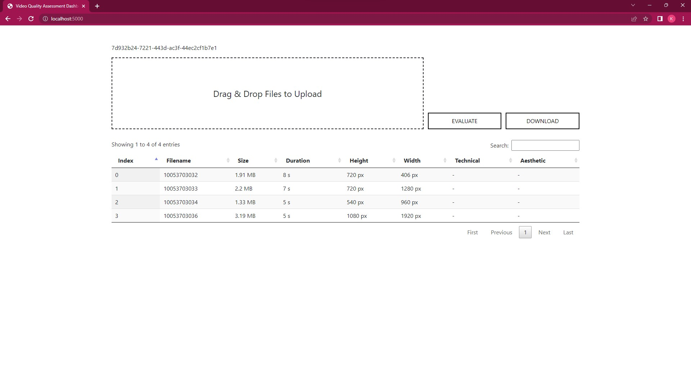
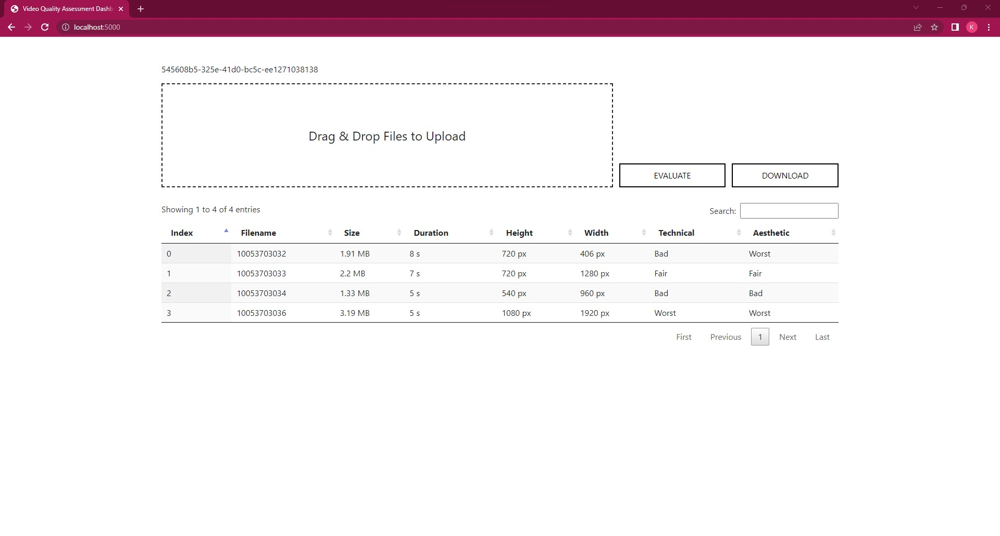

# Video-Quality-Assessment-Flask-Dashboard

### About

This is a web-based interface for an algorithm called DOVER (Disentangling Aesthetic and Technical Effects for Video Quality Assessment of User Generated Content) that would allow users to interact with DOVER through a web browser, making it more accessible and convenient for users who want to assess the quality of their videos. This interface is built using a web development framework called Flask, which is a lightweight Python framework that allows developers to build web applications quickly.



DOVER is designed to disentangle aesthetic and technical effects when evaluating the quality of a video. Aesthetic effects refer to the visual appeal of the video, such as the composition, lighting, and colour grading, while technical effects refer to the technical aspects of the video, such as resolution, frame rate, and bitrate. By separating these two types of effects, DOVER aims to provide a more accurate and comprehensive assessment of the overall quality of the video.

### Getting Started

Use the terminal or an Anaconda Prompt for the following steps:

#### Clone this repo:
```
git clone https://github.com/KrishnaPhalgun28/Video-Quality-Assessment-Flask-Dashboard.git
```

#### Change to the repo directory:
```
cd Video-Quality-Assessment-Flask-Dashboard
```

#### Create the environment from the ``environment.yml`` file:
```
conda env create -f environment.yml
```

#### Activate the new environment:
```
conda activate vqa
```

#### Verify that the new environment was installed correctly:
```
conda info --envs
```

#### Run the app:
```
python ./dashboard.py
```



### Logs

| Index | Filename    | Size    | Duration | Height  | Width   | Technical           | Aesthetic           |
|-------|-------------|---------|----------|---------|---------|---------------------|---------------------|
| 0     | 10053703032 | 1.91 MB | 8 s      | 720 px  | 406 px  | -0.5506605973639963 | -1.1236979548934467 |
| 1     | 10053703033 | 2.2 MB  | 7 s      | 720 px  | 1280 px |  0.3083066024870503 |  0.7302504056404503 |
| 2     | 10053703034 | 1.33 MB | 5 s      | 540 px  | 960 px  | -0.5312615059468662 | -0.4483086324642102 |
| 3     | 10053703036 | 3.19 MB | 5 s      | 1080 px | 1920 px | -1.9432594891608730 | -1.2976735513429503 |

### Link to demo

https://drive.google.com/file/d/1wNPHJgiWwC_Uq_YTvv-ohMfjar3j5zdf/view?usp=share_link

### References

| Demo Video  | Link                                                                                                        |
|-------------|-------------------------------------------------------------------------------------------------------------|
| 10053703032 | https://github.com/QualityAssessment/DOVER/tree/master/demo                                                 |
| 10053703033 | https://github.com/QualityAssessment/DOVER/tree/master/demo                                                 |
| 10053703034 | https://github.com/QualityAssessment/FAST-VQA-and-FasterVQA/tree/dev/demos                                  |
| 10053703036 | https://www.pexels.com/video/a-couple-in-a-park-overseeing-sydney-city-skyline-and-the-opera-house-3209971/ |

```bibtex
@article{wu2022disentanglevqa,
  title={Disentangling Aesthetic and Technical Effects for Video Quality Assessment of User Generated Content},
  author={Wu, Haoning and Liao, Liang and Chen, Chaofeng and Hou, Jingwen and Wang, Annan and Sun, Wenxiu and Yan, Qiong and Lin, Weisi},
  journal={arXiv preprint arXiv:2211.04894},
  year={2022}
}

@article{wu2022fastquality,
  title={FAST-VQA: Efficient End-to-end Video Quality Assessment with Fragment Sampling},
  author={Wu, Haoning and Chen, Chaofeng and Hou, Jingwen and Liao, Liang and Wang, Annan and Sun, Wenxiu and Yan, Qiong and Lin, Weisi},
  journal={Proceedings of European Conference of Computer Vision (ECCV)},
  year={2022}
}

@misc{end2endvideoqualitytool,
  title = {Open Source Deep End-to-End Video Quality Assessment Toolbox},
  author = {Wu, Haoning},
  year = {2022},
  url = {http://github.com/timothyhtimothy/fast-vqa}
}
```
